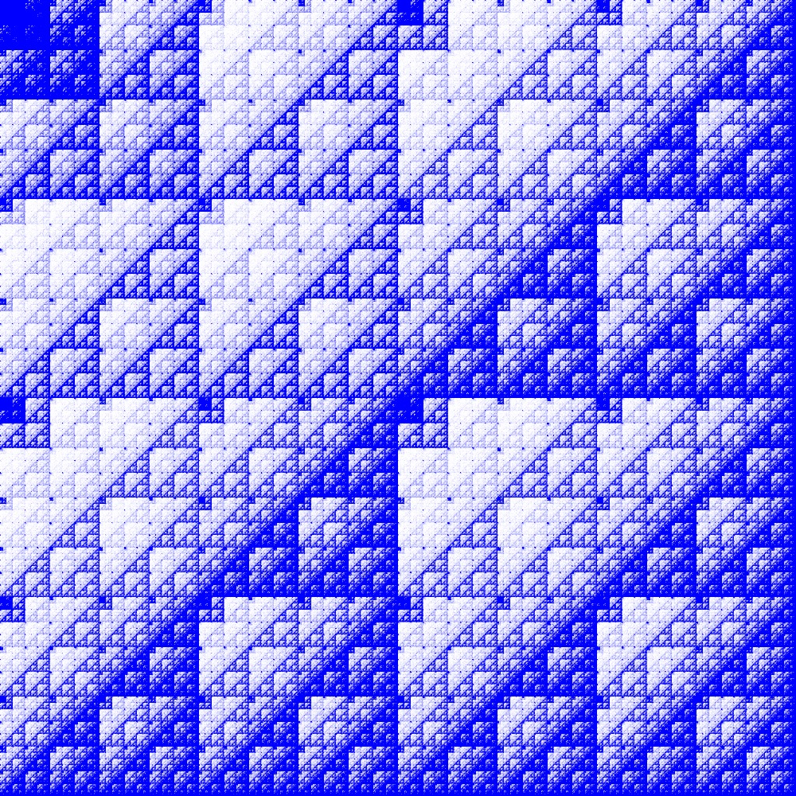
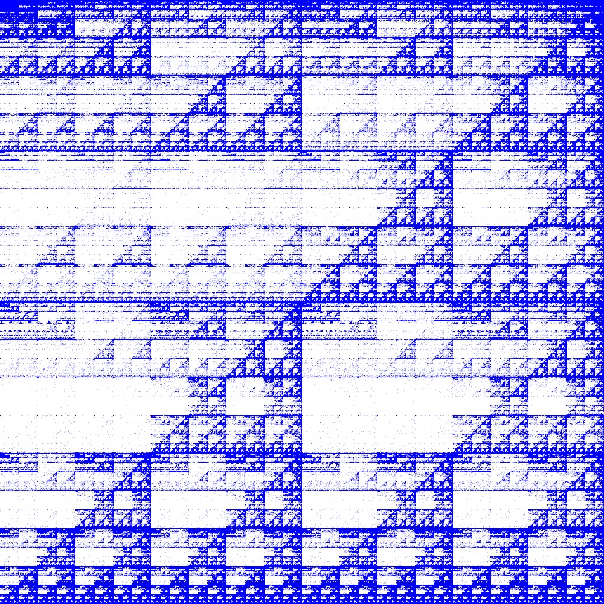
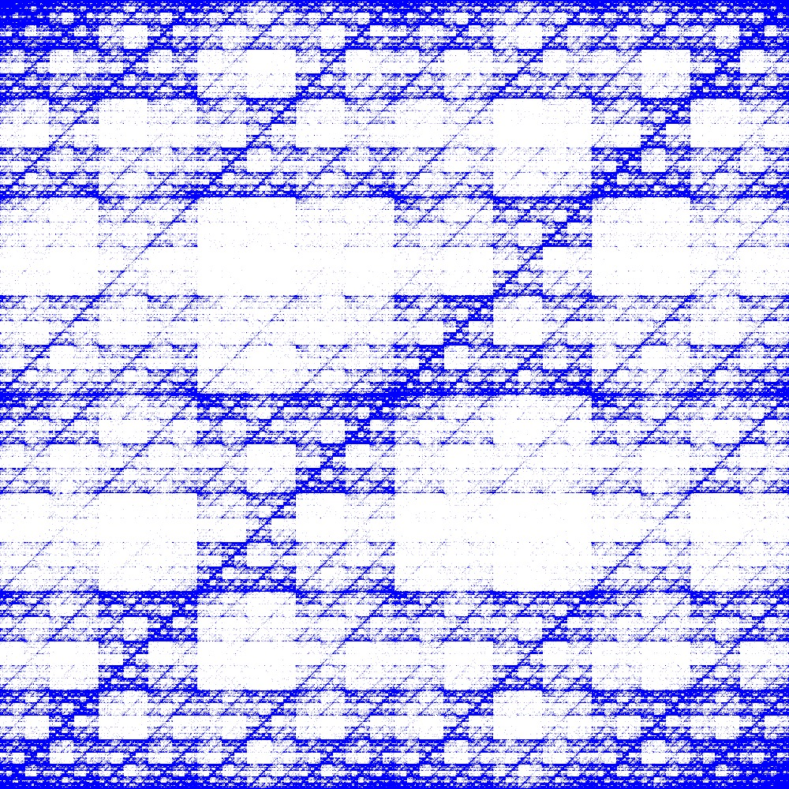
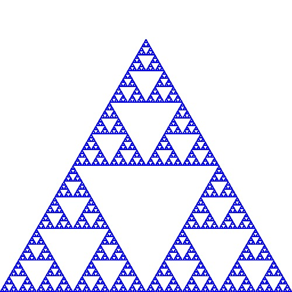

# Chaos Games Driven by Popular Data Sets

There have been several studies recently using chaos games to investigate correlations within DNA sequences (one of the most cited is
[Hao, Lee, Zhang (2000)](https://www.sciencedirect.com/science/article/pii/S0960077998001829)). DNA sequences are complicated high-dimensional structures, so it seems natural to look at several commonly used machine learning datasets in a similar way.

## Results

White Noise | MNIST 
----------- | -----
 | 

Fashion MNIST | CIFAR-10 
--------------|---------
 | 

## How it works

The canonical example is a construction of a [Sierpinski Triangle](https://en.wikipedia.org/wiki/Sierpinski_triangle). Choose a random point in the middle of a triangle. Choose a random vertex of the triangle. Move half-way to that vertex. Define this as the new starting position and repeat. This results in a Sierpinski Triangle:

The action of choosing random vertices can be viewed as mapping from some set of values to vertices. Consequently, it's possible to make a game up using the values from most data sets. The above square graphics were made by playing a game of chaos with four vertices. The quartiles of pixel luminosities from within the data are used to determine which vertex to move to. The game is then played by reading through each pixel in the training data set sequentially. A small amount of white noise is added to the images as preprocessing; there are a lot of completely black pixels in MNIST which can scupper results.

## Reproduce results
Everything was done in Julia 1.0. To reproduce results, run `dataset_chaos.jl`. Dependent libraries are Images, MLDatasets, Colors, FileIO and Statistics. The script should prompt to download all required data via MLDatasets. After the download, generating the rest of the images is relatively quick (a few minutes).

Investigating audio files was done, but no compelling pictures were made. Code to do this is included but commented out (requires the WAV library), in case anyone would like to try for themselves.
